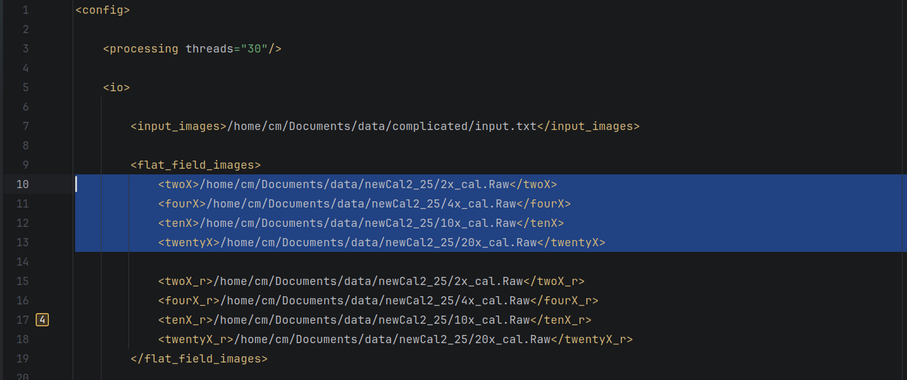
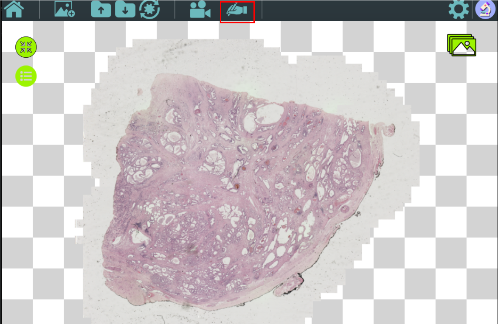
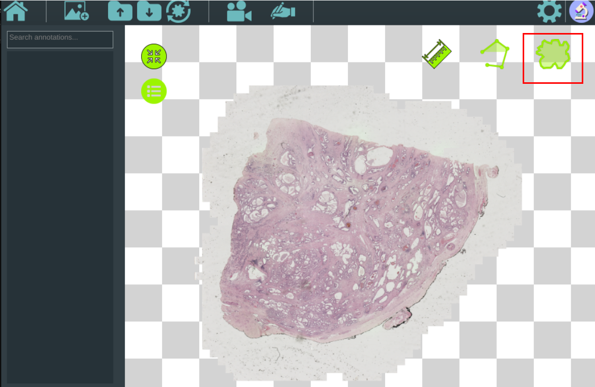

**Note: Our internal name for HistoCAM is pathcam and the provided code's naming convention follows this internal name.**

The HistoCAM system generally runs on the NVidia Spark DGX with unified memory and ample GPU compute. Here, we offer a CPU-only configuration that can demonstrate the compositing capabilities by reading frames from disk to simulating a microscope recording. This demonstration requires only that OpenCV is installed with Contrib. In order to run without GPU support, this configuration fills image tiles rather than all frame data, and as a result looks a bit different than the configuration used in our video figures. The version of the code that was used in our video figures can also be used if you prefer, but it requires OpenCV to be built with CUDA support and a unified memory system like the Spark DGX.

Before beginning install the OpenCV library with Contrib modules. This install should take no more than 20 minutes and can be done autonomously by Claude Code. Instructions are provided in `opencv_install_guide.docx`.
Run [cmake](https://cmake.org) and pass your OpenCV installation with `-DOpenCV_DIR=/path/to/opencv/lib/cmake/opencv4`

The dataset can be found on Zenodo at https://zenodo.org/records/21970445. The raw input files are zipped in batches of 50 and labeled n_to_m.zip. Download each of these and unzip the contents into a common "raw" folder. Then, run the debayer program with the full path to the "raw" folder on your computer as the program argument.

```
debayer /absolute/path/to/raw/folder
```

Use the absolute path to this folder, not relative path. This will create a "png" folder with the fullsized images in viewable format, as well as an `input.txt` file which the compositing program will use to simulate microscope input.

Next, open the `config.xml` file. In this file near the top, you will see 4 fields pertaining to flatfield correction:



Change these four file paths to the correct file paths for calibration images on your computer (download from Zenodo, labeled `2x_cal.Raw`, etc). You don't need to change anything else in the config file for now, just save your changes.

Now, run the pathCamApp program with the argument `--config-file=/path/to/config.xml`. After compilation there should be a directory inside of your build directory named `pathCamApp_artefacts` that contains the executable.

```
pathcam --config-file=/path/to/config.xml
```

When the program launches, click the camera icon . This should bring you to an empty checkerboard screen. Now hit the `<spacebar>` to launch a file selector window. Find the `input.txt` file that was created by the debayer program and double click it. Press the `<spacebar>` again to begin compositing. When compositing has concluded, you can press the `<c>` key to switch between objectives, and the `<s>` key to highlight areas covered by each objective.

If you have access to a unified memory system with CUDA and would like to use the AI segmentation, first download a compatible version of TensorRT (> 10). Use `trtexec` to convert the encoder and decoder model found on box with the commands found in `comands.txt`. Change the paths in `config.xml` version to the output of your encoder and decoder paths. You must also make sure that OpenCV is compiled with CUDA. Pass your TensorRT path to cmake with `-DTENSORRT_ROOT=/path/to/your/TensorRT-10.14.1.48.Linux.aarch64-gnu.cuda-13.0/TensorRT-10.14.1.48` and rerun cmake. Once running with OpenCV+CUDA and TensorRT, once compositing has finished, click the annotation icon:



and then click the semantic segmentation button:



`<shift + click>` to add points, then run by pressing the `<q>` key.

Additionally, if you are running with this build configuration you can also run the original version of the code as shown in video figures. To do this, in `pathcam/StreamCam.h`, comment out line 107 and uncomment line 108. Build and rerun.
